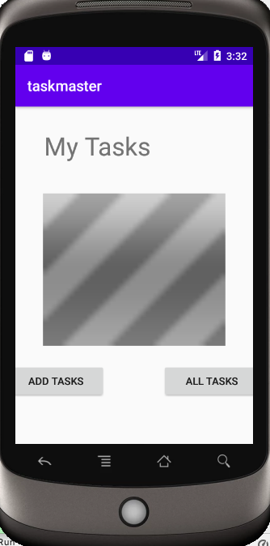
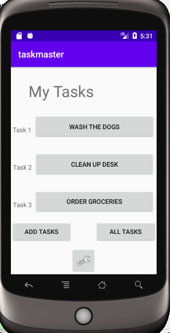
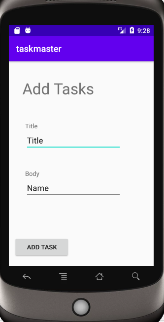
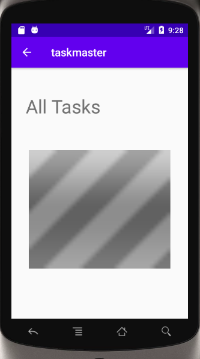
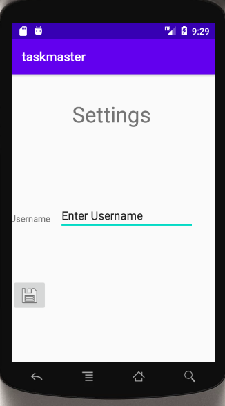
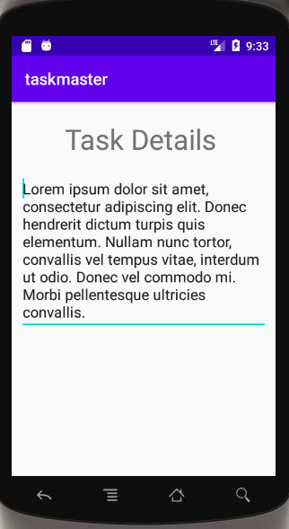
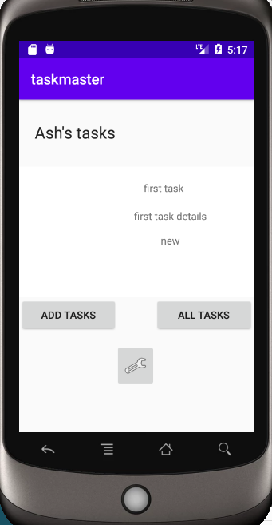

# taskmaster

## Java 401 Android Studio App

An Android app that reflects my knowledge of Android Studio and is built upon daily with new features throughout the second half of CodeFellows' Java 401 course.

## Daily Change Log

### Class 26 | 10.19.2020
  - Lab SetUp
  - Feature Tasks
    - Homepage
      - Created home page with header, placeholder image, and buttons to navigate to add tasks page and all tasks page.

      <!--  -->
      -   

    - Add a Task
      - Created add tasks page with form for users to add task title and body
      - Added a submit button with toast
   
    - All Tasks
      - Created all tasks page with header, placeholder image, and back button

### Class 27 | 10.20.2020
  - Feature Tasks
    - Homepage
      - Hardcode three different task buttons
      - Add Settings button

      - 
    
    - Add Tasks

      - 
    
    - All Tasks

      - 
    
    - Settings
      - Created settings page with title and user input form.
      - Allowed user's to save username

      - 
    
    - Task Detail
      - Created task detail page with title and lorem ipsum description

      - 

### Class 28 | 10.29.2020
- Feature Tasks
    - Homepage
      - Use RecyclerView to display task data
      - 
